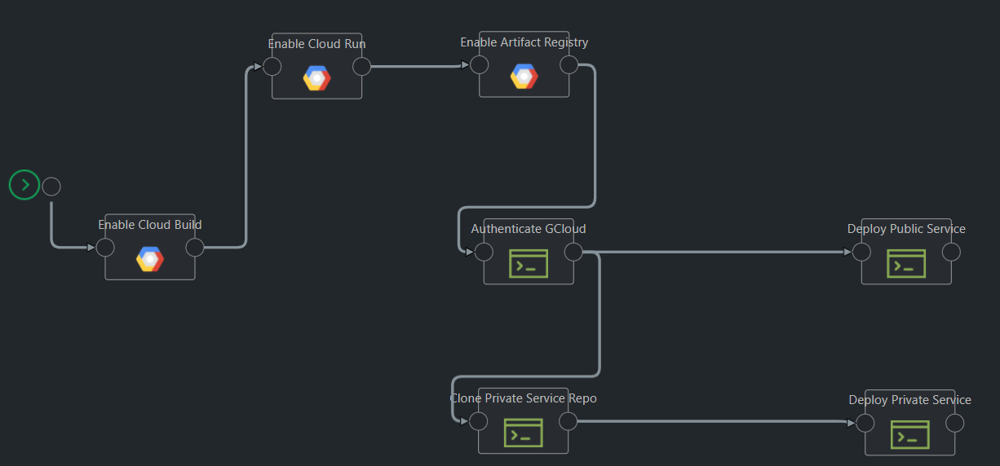

## GCP Container App

This pipeline template makes use of the [Google Cloud Services](https://github.com/Kaholo/kaholo-plugin-google-cloud-services) plugin and the [Command Line](https://github.com/Kaholo/kaholo-plugin-cmd) plugin. It can be used to deploy public container images, or container images built from source to Google Cloud Run.

### Pipeline Template



### Configuration Variables

- **project**: The GCP Project. The service account must belong to the same project and the resources will be created in the same project.
- **region**: The region where the resources are to be deployed.
- **serviceAccountVaultName**: The name of the Vault variable that stores the Service account credentials. Can leave it to default `GCP SVC Creds` if the Credentials have been uploaded to vault under the same name.
- **publicServiceName**: The name of the service under which it will be deployed in Cloud Run.
- **publicServiceImage**: The image URL to deploy. The URL must be either of Google Container Registry, or Google Artifact Registry. Cloud Run does not support other docker registries.
- **privateServiceName**: The name of the service under which it will be deployed in Cloud Run.
- **privateServiceRepoURL**: The URL of the repo which is to be built and deployed.
- **privateServiceSourceDir**: Path to the Dockerfile in your repo. If the Dockerfile sits in the root, then leave it as `.`

##### Example

```
{
    "project": "sample-project",
    "region": "us-east1",
    "serviceAccountVaultName": "GCP SVC Creds",
    "publicServiceName": "nginx-service",
    "publicServiceImage": "gcr.io/google-containers/nginx",
    "privateServiceName": "python-service",
    "privateServiceRepoURL": "https://github.com/GoogleCloudPlatform/python-docs-samples",
    "privateServiceSourceDir": "python-docs-samples/run/helloworld"
}
```

### Vault Secrets

- **GCP SVC Creds**: The JSON contents of the Service Account key file.

### How to Use

The template consists of two flows -

- Deploy a public container image to Cloud run.
Ideal when there is a public image available for a service you want to deploy. To use this flow -
    - Detach the "Clone Private Service Repo" block from "Authenticate GCloud" block.
    - Provide values for `public*` configuration variables. No need to specify values for `private*` ones. Note that `project`, `region`, and `serviceAccountVaultName` are mandatory.

- Deploy a container image built from source to Cloud Run.
Ideal when you have the source code with a Dockerfile, and you want to build the container image and deploy. To use this flow -
    - Detach the "Deploy Public Service" block from "Authenticate GCloud" block.
    - Provide values for `private*` configuration variables. No need to specify values for `public*` ones. Note that `project`, `region`, and `serviceAccountVaultName` are mandatory.
